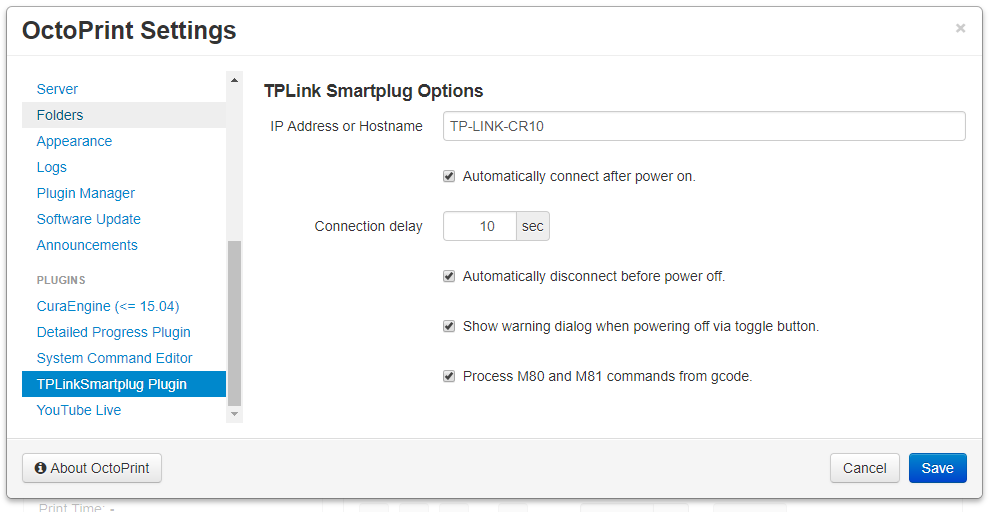
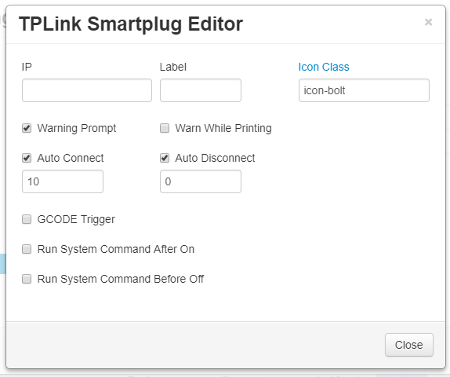

# OctoPrint-TPLinkSmartplug

Work inspired by [OctoPrint-PSUControl](https://github.com/kantlivelong/OctoPrint-PSUControl) and [TP-Link WiFi SmartPlug Client](https://github.com/softScheck/tplink-smartplug), this plugin controls a TP-Link Smartplug via OctoPrint's nav bar. 

##  Screenshots

## Setup

Install via the bundled [Plugin Manager](https://github.com/foosel/OctoPrint/wiki/Plugin:-Plugin-Manager)
or manually using this URL:

    https://github.com/jneilliii/OctoPrint-TPLinkSmartplug/archive/master.zip

## Configuration

Once installed go into settings and enter the ip address for your TP-Link Smartplug device. Adjust additional settings as needed.

## Settings Explained
- **IP**
  - IP or hostname of plug to control.
- **Label**
  - Label to use for title attribute on hover over button in navbar.
- **Icon Class**
  - Class name from [fontawesome](http://fontawesome.io/3.2.1/cheatsheet/) to use for icon on button.
- **Warn**
  - The left checkbox will always warn when checked.
  - The right checkbox will only warn when printer is printing.
- **GCODE**
  - When checked this will enable the processing of M80 and M81 commands from gcode to power on/off plug.  Syntax for gcode command is M80/M81 followed by hostname/ip.  For example if your plug is 192.168.1.2 your gcode command would be **M80 192.168.1.2**
- **postConnect**
  - Automatically connect to printer after plug is powered on.
  - Will wait for number of seconds configured in **Auto Connect Delay** setting prior to attempting connection to printer.
- **preDisconnect**
  - Automatically disconnect printer prior to powering off the plug.
  - Will wait for number of seconds configured in **Auto Disconnect Delay** prior to powering off the plug.
- **Cmd On**
  - When checked will run system command configured in **System Command On** setting after a delay in seconds configured in **System Command On Delay**.
- **Cmd Off**
  - When checked will run system command configured in **System Command Off** setting after a delay in seconds configured in **System Command Off Delay**.
  
## Support My Efforts
I programmed this plugin for fun and do my best effort to support those that have issues with it, please return the favor and support me.

