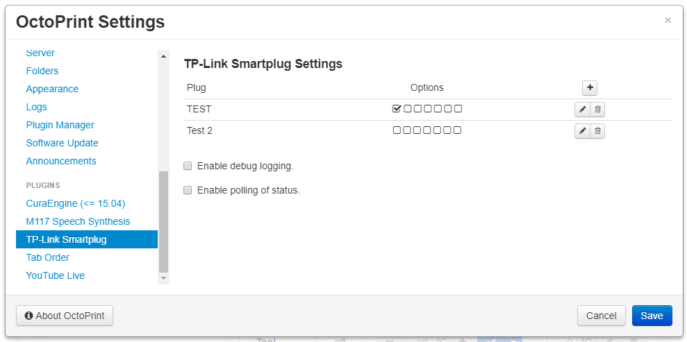

# OctoPrint-TPLinkSmartplug

***Warning***: Recent firmware version 1.1.0 for the HS100, HS110 have been reported to break the capability of this plugin to communicate with kasa devices. So far it seems to be only effecting UK version plugs, but could spread to other firmware variants. 

***Warning***: Recent firmware updates for the HS103 breaks the use of this plugin with those devices. TP-Link may push the same firmware to other devices, but be warned that updating your devices firmware may break the use of this plugin. It appears this can be resolved by never connecting the plug to the cloud by following the steps outlined [here](https://www.tp-link.com/us/support/faq/2707/).

Work inspired by [OctoPrint-PSUControl](https://github.com/kantlivelong/OctoPrint-PSUControl) and [TP-Link WiFi SmartPlug Client](https://github.com/softScheck/tplink-smartplug), this plugin controls a TP-Link Smartplug via OctoPrint's nav bar. Currently known compatible models are the HS100, HS107, HS110, HS300, KP115. Other Kasa app based devices may work. Tapo series devices will not work with this plugin, and probably never will because of their closed communication.

##  Screenshots

## Setup

Install via the bundled [Plugin Manager](https://github.com/foosel/OctoPrint/wiki/Plugin:-Plugin-Manager)
or manually using this URL:

    https://github.com/jneilliii/OctoPrint-TPLinkSmartplug/archive/master.zip

## Configuration

Once installed go into settings and enter the ip address for your TP-Link Smartplug device. Adjust additional settings as needed.

## Settings Explained
- **IP**
  - IP or hostname of plug to control. For strip devices use the format `<ip>/<0 based socket index>`, ie 192.168.0.2/0 would control the first socket in the strip.
- **Label**
  - Label to use for title attribute on hover over button in navbar.
- **Icon Class**
  - Class name from [fontawesome](https://fontawesome.com/v3.2.1/icons/) to use for icon on button.
- **Warning Prompt**
  - Always warn when checked.
- **Warn While Printing**
  - Will only warn when printer is printing.
- **On with Upload**
  - When checked, this will allow connected slicers to power on the device when uploading a file.  This requires OctoPrint 1.4.1rc or higher, and does not currently support uploading through the web browser.
- **Use Countdown Timers**
  - Uses the plug's built in countdown timer rule to postpone the power on/off by configured delay in seconds.
- **GCODE Trigger**
  - When checked this will enable the processing of M80 and M81 commands from gcode to power on/off plug.  Syntax for gcode command is M80/M81 followed by hostname/ip.  For example if your plug is 192.168.1.2 your gcode command would be **M80 192.168.1.2**
  - Added with version 0.9.5 you can now use the custom gcode commands `@TPLINKON` and `@TPLINKOFF` followed by the IP address of the plug.  This option will only work for plugs with GCODE processing enabled.  For example if your plug is 192.168.1.2 your gcode command would be **@TPLINKON 192.168.1.2**
- **Auto Connect**
  - Automatically connect to printer after plug is powered on.
  - Will wait for number of seconds configured in **Auto Connect Delay** setting prior to attempting connection to printer.
- **Auto Disconnect**
  - Automatically disconnect printer prior to powering off the plug.
  - Will wait for number of seconds configured in **Auto Disconnect Delay** prior to powering off the plug.
- **Run System Command After On**
  - When checked will run system command configured in **System Command On** setting after a delay in seconds configured in **System Command On Delay**.
- **Run System Command Before Off**
  - When checked will run system command configured in **System Command Off** setting after a delay in seconds configured in **System Command Off Delay**.
  
## Most recent changelog

**[1.0.1](https://github.com/jneilliii/OctoPrint-TPLinkSmartplug/releases/tag/1.0.0)** (04/15/2021)

* fix issue introduced with last update that prevented adding new plugs.

### [All releases](https://github.com/jneilliii/OctoPrint-TPLinkSmartplug/releases)

## Get Help

If you experience issues with this plugin or need assistance please use the issue tracker by clicking issues above.

### Additional Plugins

Check out my other plugins [here](https://plugins.octoprint.org/by_author/#jneilliii)

### Sponsors
- Andreas Lindermayr
- [@Mearman](https://github.com/Mearman)
- [@TheTuxKeeper](https://github.com/thetuxkeeper)
- [@tideline3d](https://github.com/tideline3d/)
- [SimplyPrint](https://simplyprint.dk/)
- [Andrew Beeman](https://github.com/Kiendeleo)
- [Calanish](https://github.com/calanish)
- [Will O](https://github.com/4wrxb)
- [Lachlan Bell](https://lachy.io/)
- [Johnny Bergdal](https://github.com/bergdahl)
- [Leigh Johnson](https://github.com/leigh-johnson)
- [Stephen Berry](https://github.com/berrystephenw)
- [Guyot François](https://github.com/iFrostizz)
- César Romero
- [Steve Dougherty](https://github.com/Thynix)
- [Kyle Menigoz](https://menigoz.me)
## Support My Efforts
I, jneilliii, programmed this plugin for fun and do my best effort to support those that have issues with it, please return the favor and leave me a tip or become a Patron if you find this plugin helpful and want me to continue future development.

 

<small>No paypal.me? Send funds via PayPal to jneilliii&#64;gmail&#46;com</small>

